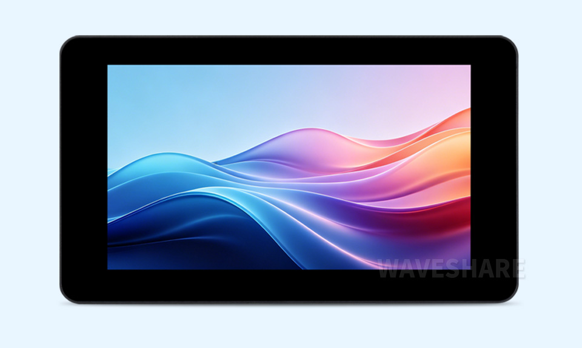

# Waveshare ESP32-S3-Touch-LCD-7C 产品工程示例程序

[English](README.md)

这款产品为 **ESP32-S3-Touch-LCD-7C**，基于 ESP32-S3 的 7 英寸 RGB LCD 电容触控开发板，可用于 GUI（如 LVGL）开发与外设功能验证。

- [Purchase Link](https://www.waveshare.com/ESP32-S3-Touch-LCD-7C-BOX.htm)
- [Documentation](https://docs.waveshare.net/ESP32-S3-Touch-LCD-7C-BOX)

---

## 🔧 配置

您可以在产品 Wiki / 文档页面上找到详细的配置信息。

---

## 🛠️ 贡献

我们欢迎您的贡献！您可以通过以下方式提供帮助：

1. Fork 本仓库。
2. 为您的新功能或 Bug 修复创建一个新分支。
3. 提交您的更改并附上清晰的描述。
4. 提交 Pull Request 以供审核。

---

## 🧩 问题与支持

如果您遇到任何问题：

- 请先查看 `https://gitee.com/waveshare/ESP32-S3-Touch-LCD-7C/issues` 版块。
- 创建一个新的 Issue 并提供详细信息。
- 参考文档获取故障排除提示。
- 联系微雪团队并提供订单号以获取技术支持。

---

## 📜 许可

本仓库遵循 Apache License 许可。详情请参阅 [LICENSE](LICENSE) 文件。

---

## 🙌 致谢

- 感谢微雪电子提供的硬件平台和软件支持。
- 感谢乐鑫团队的持续支持。
- 感谢让这些项目成为可能的开源贡献者。

---

感谢您使用微雪电子产品！🚀
